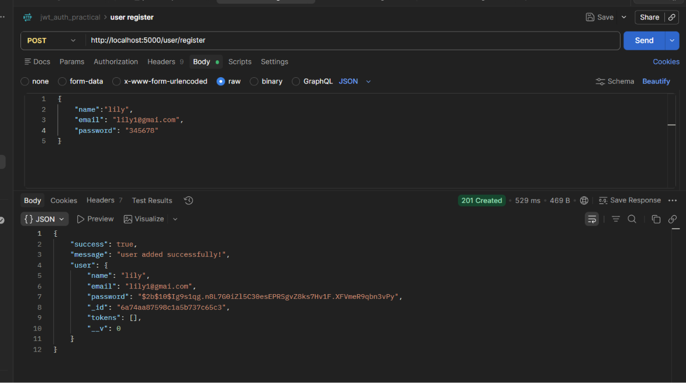
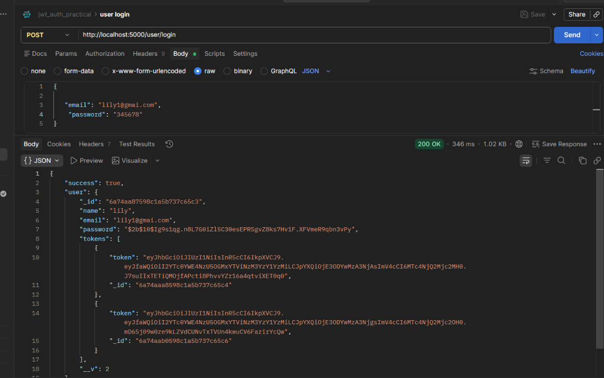
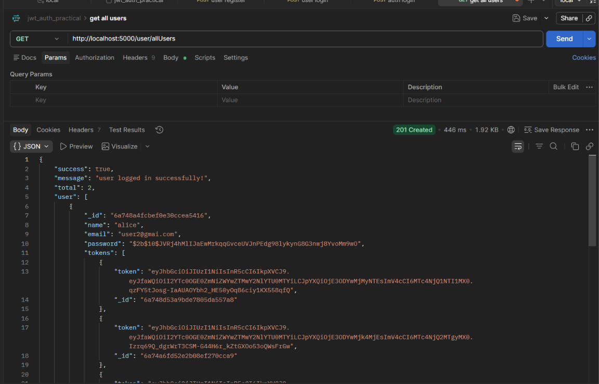
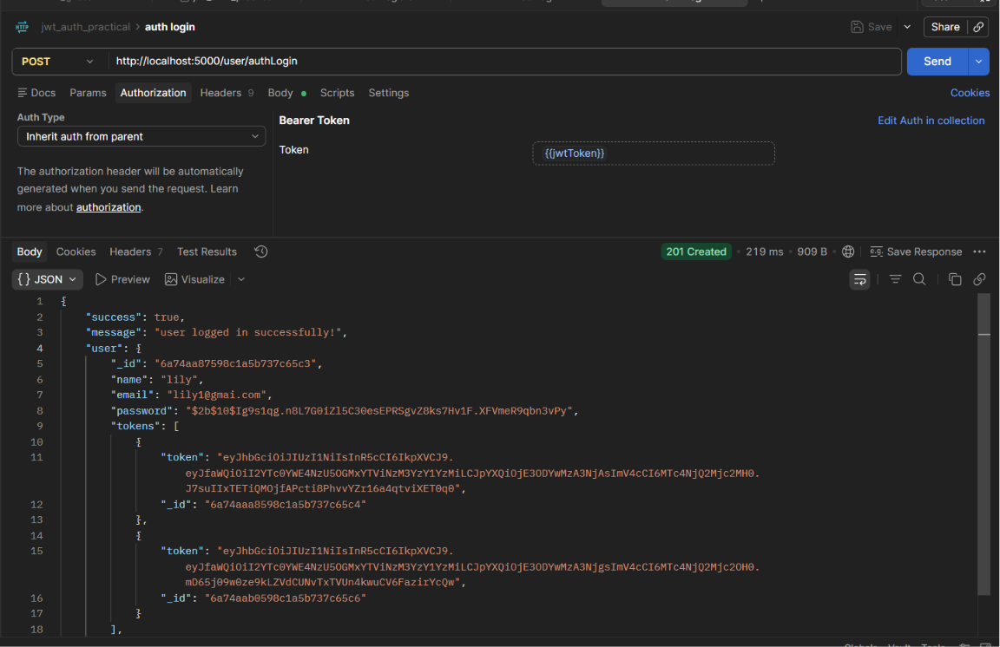
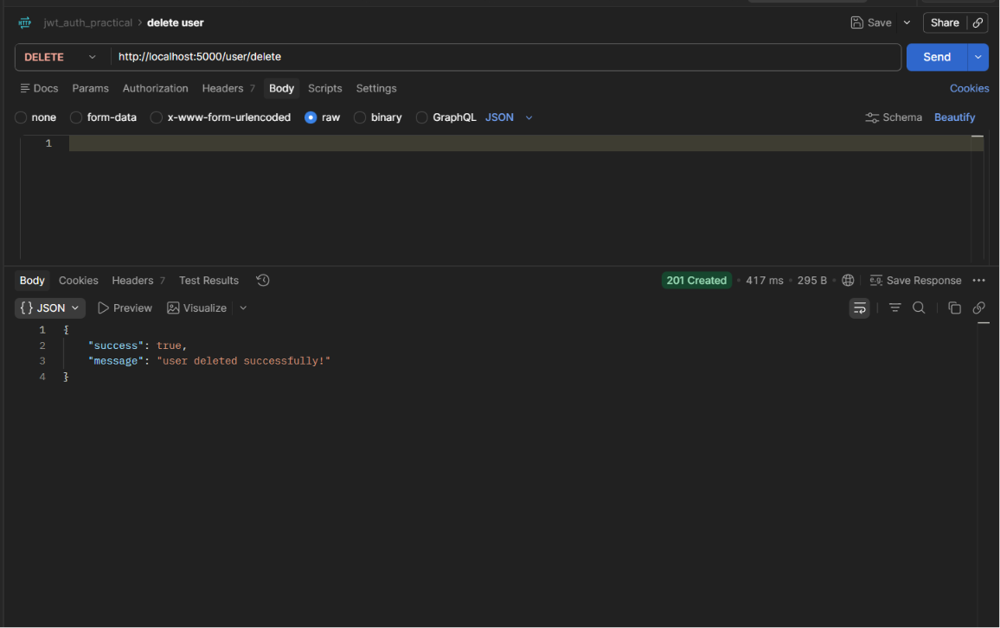
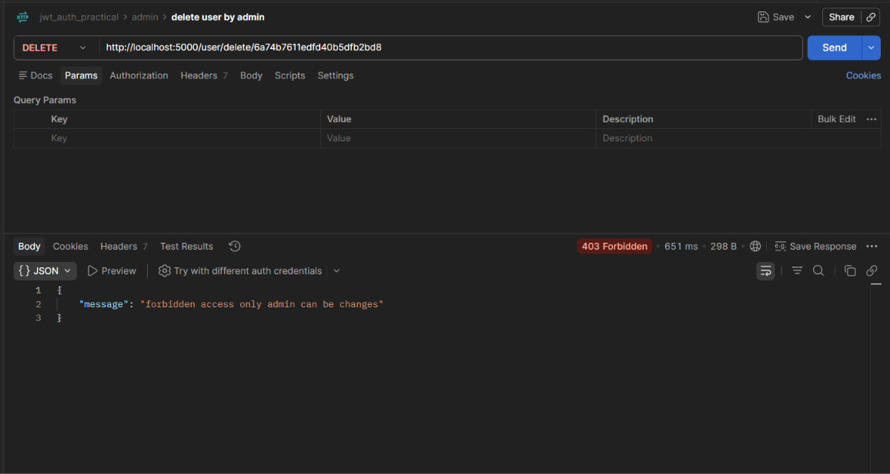
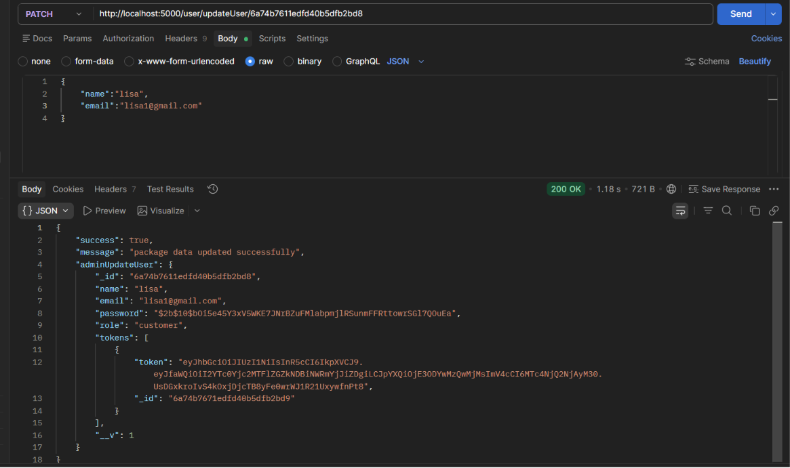
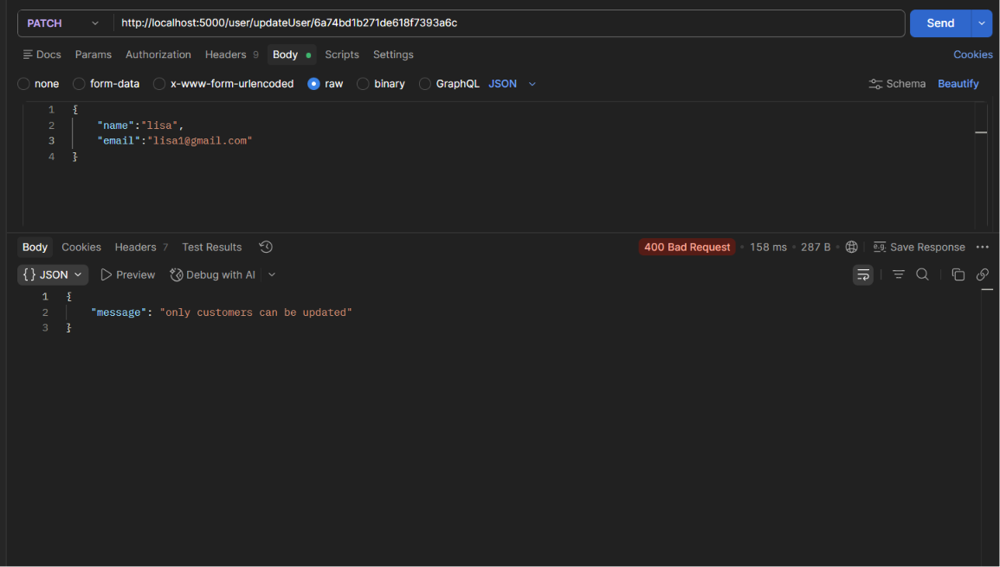

# JWT Authentication & RBAC API

A small backend project built with **Node.js, Express.js, MongoDB Atlas, and JWT Authentication**.

This project demonstrates user **CRUD operations, secure authentication using JWT, password hashing with bcrypt, and Role-Based Access Control (RBAC)** for managing customer and admin access.

---

## 🚀 Features

- User Registration
- User Login
- JWT Authentication
- Password Hashing using Bcrypt
- User CRUD Operations
- User Profile Authentication
- User Logout
- Role-Based Access Control (RBAC)
- Customer and Admin Roles
- Admin-only User Management
- MongoDB Atlas Database
- Error Handling using Custom HttpError Middleware

---

## 🛠️ Technologies Used

- Node.js
- Express.js
- MongoDB Atlas
- Mongoose
- JWT (JSON Web Token)
- Bcrypt
- dotenv
- Postman

---

## 📁 Project Structure

```text
jwt-auth-practical-exam/
│
├── config/
│   └── db.js
│
├── controller/
│   └── user.controller.js
│
├── middleware/
│   ├── auth.js
│   ├── checkRole.js
│   └── HttpError.js
│
├── model/
│   └── user.model.js
│
├── router/
│   └── user.router.js
│
├── .env
├── .gitignore
├── package.json
├── package-lock.json
└── server.js

-------------------------------------------------------------------------------------

## 📸 Postman API Testing

All APIs were tested using Postman.

### 1. User Registration

User registration API tested successfully.



----------------------

### 2. User Login

User login with JWT token generation.



---------------------

### 3. Get All Users

Fetch all registered users.



---------------------------

### 4. Authenticated User

Authenticated user API tested using JWT token.



------------------------

### 5. User Delete

Customer can delete their own account.



------------------------

### 6. Admin Delete Customer

Admin can delete a customer using the customer's ID.



--------------------------

### 7. Customer Update Own Profile

Customer can update their own profile.



----------------------------

### 8. Admin Cannot Update Customer

Admin is not allowed to update customer information.




-------------------------

### 🔐 Role-Based Access Control

The project supports two roles:

- **Customer** – Can manage their own profile and account.
- **Admin** – Can manage customers, including deleting customer accounts.

Access to APIs is controlled using JWT authentication and role-based middleware.

## 👩‍💻 Author

**Charmee Paneliya**

Full Stack Developer